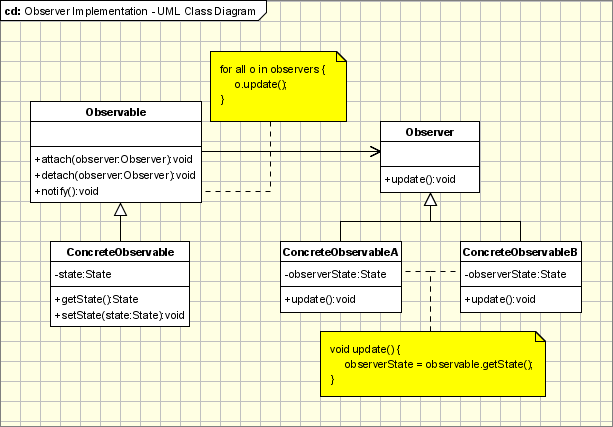

## Observer
The observer pattern is a software design pattern where an object, called the subject or publisher, maintains a list of its dependents, called observers.

>image from: https://www.oodesign.com/observer-pattern.html